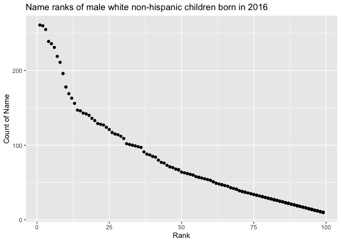

p8105\_hw2\_jl6049
================
LYU JING
10/2/2021

## Problem 1

Read and clean the Mr. Trash Wheel sheet:

``` r
Trash_data = 
  read_excel("../data/Trash-Wheel-Collection-Totals-8-6-19.xlsx", sheet = "Mr. Trash Wheel", range = "A2:N408") %>%
  janitor::clean_names()%>%
  drop_na(dumpster)%>%
  mutate(sports_balls = round(sports_balls))
```

specify the sheet in the Excel file and to omit non-data entries (rows
with notes / figures; columns containing notes) using arguments in
read\_excel use reasonable variable names omit rows that do not include
dumpster-specific data round the number of sports balls to the nearest
integer

Read and clean precipitation data for 2018 and 2019. For each, omit rows
without precipitation data and add a variable for year.

``` r
Pre_2019_data = 
  read_excel("../data/Trash-Wheel-Collection-Totals-8-6-19.xlsx", sheet = "2019 Precipitation", skip = 1)%>%
  janitor::clean_names()%>%
  drop_na(total,month)%>%
  mutate(year = 2019)


Pre_2018_data = 
  read_excel("../data/Trash-Wheel-Collection-Totals-8-6-19.xlsx", sheet = "2018 Precipitation", skip = 1)%>%
  janitor::clean_names()%>%
  drop_na(total,month)%>%
  mutate(year = 2018)
```

Next, combine precipitation datasets and convert month to a character
variable (the variable month.name is built into R and should be useful).

``` r
Pre_combine = 
  bind_rows(Pre_2018_data, Pre_2019_data)%>%
  mutate(month = month.name[month])%>%
  select(year, month, total)


summary(Trash_data)
```

    ##     dumpster         month                year     
    ##  Min.   :  1.00   Length:344         Min.   :2014  
    ##  1st Qu.: 86.75   Class :character   1st Qu.:2015  
    ##  Median :172.50   Mode  :character   Median :2017  
    ##  Mean   :172.50                      Mean   :2016  
    ##  3rd Qu.:258.25                      3rd Qu.:2018  
    ##  Max.   :344.00                      Max.   :2019  
    ##       date                      weight_tons    volume_cubic_yards
    ##  Min.   :2014-05-16 00:00:00   Min.   :0.960   Min.   : 7.00     
    ##  1st Qu.:2015-07-05 00:00:00   1st Qu.:2.757   1st Qu.:15.00     
    ##  Median :2017-03-31 00:00:00   Median :3.265   Median :15.00     
    ##  Mean   :2016-12-23 10:57:12   Mean   :3.263   Mean   :15.54     
    ##  3rd Qu.:2018-05-19 18:00:00   3rd Qu.:3.772   3rd Qu.:16.00     
    ##  Max.   :2019-06-17 00:00:00   Max.   :5.620   Max.   :20.00     
    ##  plastic_bottles   polystyrene   cigarette_butts  glass_bottles   
    ##  Min.   : 210.0   Min.   : 320   Min.   :   980   Min.   :  0.00  
    ##  1st Qu.: 957.5   1st Qu.:1065   1st Qu.:  7000   1st Qu.: 10.00  
    ##  Median :1835.0   Median :2075   Median : 19000   Median : 21.50  
    ##  Mean   :1873.2   Mean   :2139   Mean   : 30754   Mean   : 25.36  
    ##  3rd Qu.:2552.5   3rd Qu.:3120   3rd Qu.: 38000   3rd Qu.: 38.00  
    ##  Max.   :5960.0   Max.   :6540   Max.   :310000   Max.   :110.00  
    ##   grocery_bags    chip_bags       sports_balls   homes_powered  
    ##  Min.   :  50   Min.   : 230.0   Min.   : 0.00   Min.   : 0.00  
    ##  1st Qu.: 600   1st Qu.: 977.5   1st Qu.: 5.00   1st Qu.:35.62  
    ##  Median :1050   Median :1630.0   Median : 8.00   Median :51.42  
    ##  Mean   :1311   Mean   :1780.3   Mean   :11.81   Mean   :43.83  
    ##  3rd Qu.:1912   3rd Qu.:2490.0   3rd Qu.:16.00   3rd Qu.:59.50  
    ##  Max.   :3750   Max.   :5085.0   Max.   :56.00   Max.   :93.67

``` r
skimr::skim(Trash_data)%>%
  select(numeric.mean)
```

    ## # A tibble: 14 × 1
    ##    numeric.mean
    ##           <dbl>
    ##  1        NA   
    ##  2       172.  
    ##  3      2016.  
    ##  4         3.26
    ##  5        15.5 
    ##  6      1873.  
    ##  7      2139.  
    ##  8     30754.  
    ##  9        25.4 
    ## 10      1311.  
    ## 11      1780.  
    ## 12        11.8 
    ## 13        43.8 
    ## 14        NA

``` r
sum(select(filter(Pre_combine,year == 2018),total))
```

    ## [1] 70.33

``` r
median(pull(filter(Trash_data,year == 2019),sports_balls))
```

    ## [1] 8.5

Write a paragraph about these data; you are encouraged to use inline R.
Be sure to note the number of observations in both resulting datasets,
and give examples of key variables. For available data, what was the
total precipitation in 2018? What was the median number of sports balls
in a dumpster in 2019???????

For the first dataset “Mr. Trash Wheel”, we could got 344 observations
of dumpster and 14 dimensions to evaluate the data. Accordingly, the key
variables are dumpster, month, year, date, weight\_tons,
volume\_cubic\_yards, plastic\_bottles, polystyrene, cigarette\_butts,
glass\_bottles, grocery\_bags, chip\_bags, sports\_balls, homes\_powered
. The median number of sports balls in a dumpster in 2019 is 8.5

For the second dataset “precipitation data”, we could got 18
observations of dumpster and 3 dimensions to evaluate the data.
Accordingly, the key variables are year, month, total. In this dataset,
we could got 12 data from 2018 and 6 data from 2019. The total
precipitation in 2018 is 70.33.

## Problem 2

This problem uses the FiveThirtyEight data; these data were gathered to
create the interactive graphic on this page. In particular, we’ll use
the data in pols-month.csv, unemployment.csv, and snp.csv. Our goal is
to merge these into a single data frame using year and month as keys
across datasets.

First, clean the data in pols-month.csv. Use separate() to break up the
variable mon into integer variables year, month, and day; replace month
number with month name; create a president variable taking values gop
and dem, and remove prez\_dem and prez\_gop; and remove the day
variable.

``` r
pols_month = 
  read_csv("../data/fivethirtyeight_datasets/pols-month.csv") %>%
  janitor::clean_names() %>%
  separate(mon, into = c("year", "month", "day"), sep = '-') %>%
  pivot_longer(
    c(prez_dem,prez_gop),
    names_to = "president", 
    names_prefix = "prez_",
    values_to = "president_values") %>%
  filter(president_values == 1) %>%
  mutate(month = as.numeric(month)) %>%
  select(-day,-president_values)
```

    ## Rows: 822 Columns: 9

    ## ── Column specification ────────────────────────────────────────────────────────
    ## Delimiter: ","
    ## dbl  (8): prez_gop, gov_gop, sen_gop, rep_gop, prez_dem, gov_dem, sen_dem, r...
    ## date (1): mon

    ## 
    ## ℹ Use `spec()` to retrieve the full column specification for this data.
    ## ℹ Specify the column types or set `show_col_types = FALSE` to quiet this message.

Second, clean the data in snp.csv using a similar process to the above.
For consistency across datasets, arrange according to year and month,
and organize so that year and month are the leading columns.

``` r
snp = 
  read_csv("../data/fivethirtyeight_datasets/snp.csv") %>%
  janitor::clean_names() %>%
  separate(date, into = c("month", "day", "year"), sep = '/') %>%
  mutate(month = as.numeric(month)) %>%
  select(-day)
```

    ## Rows: 787 Columns: 2

    ## ── Column specification ────────────────────────────────────────────────────────
    ## Delimiter: ","
    ## chr (1): date
    ## dbl (1): close

    ## 
    ## ℹ Use `spec()` to retrieve the full column specification for this data.
    ## ℹ Specify the column types or set `show_col_types = FALSE` to quiet this message.

``` r
a = mutate(filter(snp, year >= 22), year = paste0("19",year) )
b = mutate(filter(snp, year < 22), year = paste0("20",year) )

snp = bind_rows(a, b) %>%
  arrange(year,month) %>%
  relocate(year, month) 
```

Third, tidy the unemployment data so that it can be merged with the
previous datasets. This process will involve switching from “wide” to
“long” format; ensuring that key variables have the same name; and
ensuring that key variables take the same values.

``` r
mo2Num = function(x) match(tolower(x), tolower(month.abb))


unemployment = 
  read_csv("../data/fivethirtyeight_datasets/unemployment.csv") %>%
  janitor::clean_names() %>%
  pivot_longer(
    jan:dec,
    names_to = "month", 
    values_to = "unemployment")%>%
  mutate(month = mo2Num(month))%>%
  mutate(year = as.character(year))
```

    ## Rows: 68 Columns: 13

    ## ── Column specification ────────────────────────────────────────────────────────
    ## Delimiter: ","
    ## dbl (13): Year, Jan, Feb, Mar, Apr, May, Jun, Jul, Aug, Sep, Oct, Nov, Dec

    ## 
    ## ℹ Use `spec()` to retrieve the full column specification for this data.
    ## ℹ Specify the column types or set `show_col_types = FALSE` to quiet this message.

Join the datasets by merging snp into pols, and merging unemployment
into the result.

``` r
result = left_join(pols_month, snp)
```

    ## Joining, by = c("year", "month")

``` r
result = left_join(result, unemployment)
```

    ## Joining, by = c("year", "month")

Write a short paragraph about these datasets. Explain briefly what each
dataset contained, and describe the resulting dataset (e.g. give the
dimension, range of years, and names of key variables).

The fisrt dataset pols-month contains 817 observations of dumpster and 9
dimensions including year, month, gov\_gop, sen\_gop, rep\_gop,
gov\_dem, sen\_dem, rep\_dem, president to show the number of national
politicians who are democratic or republican at any given time.

The second dataset snp contains 787 observations of dumpster and 3
dimensions including year, month, close to record the closing values of
the S&P stock index on the associated date

The third dataset unemployment contains 816 observations of dumpster and
3 dimensions including year, month, unemployment to record the
percentage of unemployment on the associated month

## Problem 3

This problem uses data from NYC Open data on the popularity of baby
names, and can be downloaded here.

Load and tidy the data. Note that, although these data may seem fairly
well formatted initially, the names of a categorical predictor and the
case structure of string variables changed over time; you’ll need to
address this in your data cleaning. Also, some rows seem duplicated, and
these will need to be removed (hint: google something like “dplyr remove
duplicate rows” to get started).

``` r
baby_names = 
  read_csv("../data/popularity of baby names.csv") %>%
  janitor::clean_names() %>% 
  distinct() %>%
  mutate(ethnicity = recode(ethnicity, "ASIAN AND PACI" = "ASIAN AND PACIFIC ISLANDER"),
         ethnicity = recode(ethnicity, "WHITE NON HISP" = "WHITE NON HISPANIC"),
         ethnicity = recode(ethnicity, "BLACK NON HISP" = "BLACK NON HISPANIC"),
         childs_first_name =  str_to_title(childs_first_name),
         ) 
```

    ## Rows: 19418 Columns: 6

    ## ── Column specification ────────────────────────────────────────────────────────
    ## Delimiter: ","
    ## chr (3): Gender, Ethnicity, Child's First Name
    ## dbl (3): Year of Birth, Count, Rank

    ## 
    ## ℹ Use `spec()` to retrieve the full column specification for this data.
    ## ℹ Specify the column types or set `show_col_types = FALSE` to quiet this message.

``` r
distinct(baby_names,gender)  
```

    ## # A tibble: 2 × 1
    ##   gender
    ##   <chr> 
    ## 1 FEMALE
    ## 2 MALE

Produce a well-structured, reader-friendly table showing the rank in
popularity of the name “Olivia” as a female baby name over time; this
should have rows for ethnicities and columns for year. Produce a similar
table showing the most popular name among male children over time.??????

``` r
Olivia_rank = 
  pivot_wider(
  filter(select(baby_names,-gender,-count), childs_first_name == "Olivia" ), 
  names_from = "year_of_birth", 
  values_from = "rank") %>%
  select(-childs_first_name)
  


popular_male = 
  pivot_wider(
  filter(select(baby_names,-count), rank == 1 & gender == "MALE"), 
  names_from = "year_of_birth", 
  values_from = "childs_first_name") %>%
  select(-gender,-rank)
```

Finally, for male, white non-hispanic children born in 2016, produce a
scatter plot showing the number of children with a name (y axis) against
the rank in popularity of that name (x axis).

``` r
plot_data = 
  filter(baby_names, year_of_birth == 2016 & gender == "MALE" & ethnicity == "WHITE NON HISPANIC")
  
x = pull(plot_data, rank)
y = pull(plot_data, count)

ggplot(plot_data, aes(x = rank, y = count)) + geom_point() +  labs(title = "Name ranks of male white non-hispanic children born in 2016" , x = "Rank" , y = "Count of Name")
```

<!-- -->

``` r
  pivot_wider(
  filter(select(baby_names,-count), rank == 1 & gender == "MALE"), 
  names_from = "year_of_birth", 
  values_from = "childs_first_name") %>%
  select(-gender,-rank)
```

    ## # A tibble: 4 × 7
    ##   ethnicity                  `2016` `2015` `2014` `2013` `2012` `2011` 
    ##   <chr>                      <chr>  <chr>  <chr>  <chr>  <chr>  <chr>  
    ## 1 ASIAN AND PACIFIC ISLANDER Ethan  Jayden Jayden Jayden Ryan   Ethan  
    ## 2 BLACK NON HISPANIC         Noah   Noah   Ethan  Ethan  Jayden Jayden 
    ## 3 HISPANIC                   Liam   Liam   Liam   Jayden Jayden Jayden 
    ## 4 WHITE NON HISPANIC         Joseph David  Joseph David  Joseph Michael
