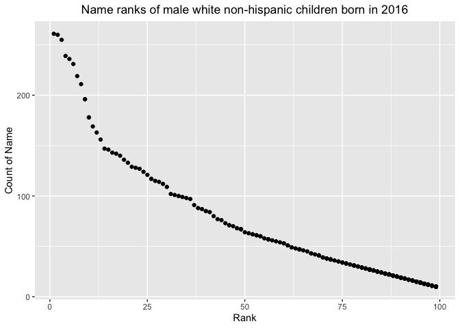

p8105\_hw2\_jl6049
================
LYU JING
10/2/2021

## Problem 1

**1. Read and clean the Mr. Trash Wheel sheet:**

``` r
Trash_data = 
  #specify the sheet in the Excel file and omit non-data entries using arguments in read_excel
  read_excel("data/Trash-Wheel-Collection-Totals-7-2020-2.xlsx", sheet = "Mr. Trash Wheel", range = "A2:N408") %>%
  # use reasonable variable names
  janitor::clean_names()%>%
  # omit rows that do not include dumpster-specific data
  drop_na(dumpster)%>%
  # round the number of sports balls to the nearest integer
  mutate(sports_balls = round(sports_balls))
```

**2. Read and clean precipitation data for 2018 and 2019. For each, omit
rows without precipitation data and add a variable for year.**

``` r
Pre_2019_data = 
  read_excel("data/Trash-Wheel-Collection-Totals-7-2020-2.xlsx", sheet = "2019 Precipitation", skip = 1) %>%
  # use reasonable variable names
  janitor::clean_names()%>%
  # omit rows that do not include dumpster-specific data
  drop_na(total,month)%>%
  # add a variable for year
  mutate(year = 2019)


Pre_2018_data = 
  read_excel("data/Trash-Wheel-Collection-Totals-7-2020-2.xlsx", sheet = "2018 Precipitation", skip = 1)%>%
  # use reasonable variable names
  janitor::clean_names()%>%
  # omit rows that do not include dumpster-specific data
  drop_na(total,month)%>%
  #add a variable for year
  mutate(year = 2018)
```

**3. Combine precipitation datasets and convert month to a character
variable**

``` r
Pre_combine = 
  # Combine precipitation datasets
  bind_rows(Pre_2018_data, Pre_2019_data) %>%
  # convert month to a character variable
  mutate(month = month.name[month]) %>%
  select(year, month, total)
```

**4. Write a paragraph about these data**

For the first dataset “Mr. Trash Wheel”, we could got 345 observations
of dumpster and 14 dimensions to evaluate the data. Accordingly, the key
variables are dumpster, month, year, date, weight\_tons,
volume\_cubic\_yards, plastic\_bottles, polystyrene, cigarette\_butts,
glass\_bottles, grocery\_bags, chip\_bags, sports\_balls, homes\_powered
. The median number of sports balls in a dumpster in 2019 is 9

For the second dataset “precipitation data”, we could got 24
observations of dumpster and 3 dimensions to evaluate the data.
Accordingly, the key variables are year, month, total. In this dataset,
we could got 12 data from 2018 and 12 data from 2019. The total
precipitation in 2018 is 70.33.

## Problem 2

**1. Clean the data in pols-month.csv**

*PS: By observing the dataset, we find out that the data in prez\_gop
has some mistake : from 1974-08-15 to 1974-12-15, the value in prez\_gop
is 2 rather than 1. Considering that the prez\_dem is 0 during 1974, we
could tell that prez\_gop should be 1, which means that the president
was republican. So I do a cleaning at the first step.*

``` r
pols_month = 
  read_csv("data/fivethirtyeight_datasets/pols-month.csv") %>%
  janitor::clean_names() %>%
  
  # Change the mistake of prez_gop
  mutate(prez_gop = recode(prez_gop, "2" = 1)) %>%
  
  # break up the variable mon into integer variables year, month, and day; replace month number with month name;
  separate(mon, into = c("year", "month", "day"), sep = '-') %>%
  mutate(month = as.integer(month),
         month = month.name[month],
         year = as.integer(year),
         day = as.integer(day)
         ) %>%
  # create a president variable taking values gop and dem, and remove prez_dem and prez_gop; 
  pivot_longer(
    c(prez_dem,prez_gop),
    names_to = "president", 
    names_prefix = "prez_",
    values_to = "president_values") %>%
  filter(president_values == 1) %>%
  # remove the day variable
  select(-day,-president_values)
```

**2. Clean the data in snp.csv.**

``` r
snp = 
  read_csv("data/fivethirtyeight_datasets/snp.csv") %>%
  janitor::clean_names() %>%
  separate(date, into = c("month", "day", "year"), sep = '/') %>%
  mutate(month = as.integer(month),
         month = month.name[month],
         year = as.integer(year) ) %>%
  select(-day)

# modify the structure of year
a = mutate(filter(snp, year >= 22), year = paste0("19",year) )
b = mutate(filter(snp, year < 22), year = paste0("20",year) )

snp = bind_rows(a, b) %>%
  # arrange according to year and month
  arrange(year,month) %>% 
  mutate(year = as.integer(year) ) %>%
  # let year and month become leading columns
  relocate(year, month) 
```

**3. Tidy the unemployment data to help it be merged with the previous
datasets.**

``` r
# write a function to help change month to number.
mo2Num = function(x) match(tolower(x), tolower(month.abb))

unemployment = 
  read_csv("data/fivethirtyeight_datasets/unemployment.csv") %>%
  janitor::clean_names() %>%
  # year and month are the leading columns
  pivot_longer(
    jan:dec,
    names_to = "month", 
    values_to = "unemployment")%>%
  # change the format of month
  mutate(month = mo2Num(month),
         month = month.name[month]) %>%
  mutate(year = as.integer(year))
```

**4. Join the datasets by merging snp into pols, and merging
unemployment into the result.**

``` r
result = left_join(pols_month, snp)
```

    ## Joining, by = c("year", "month")

``` r
result = left_join(result, unemployment)
```

    ## Joining, by = c("year", "month")

``` r
result
```

    ## # A tibble: 822 × 11
    ##     year month   gov_gop sen_gop rep_gop gov_dem sen_dem rep_dem president close
    ##    <int> <chr>     <dbl>   <dbl>   <dbl>   <dbl>   <dbl>   <dbl> <chr>     <dbl>
    ##  1  1947 January      23      51     253      23      45     198 dem          NA
    ##  2  1947 Februa…      23      51     253      23      45     198 dem          NA
    ##  3  1947 March        23      51     253      23      45     198 dem          NA
    ##  4  1947 April        23      51     253      23      45     198 dem          NA
    ##  5  1947 May          23      51     253      23      45     198 dem          NA
    ##  6  1947 June         23      51     253      23      45     198 dem          NA
    ##  7  1947 July         23      51     253      23      45     198 dem          NA
    ##  8  1947 August       23      51     253      23      45     198 dem          NA
    ##  9  1947 Septem…      23      51     253      23      45     198 dem          NA
    ## 10  1947 October      23      51     253      23      45     198 dem          NA
    ## # … with 812 more rows, and 1 more variable: unemployment <dbl>

**5. Short paragraph about these datasets**

The fisrt dataset pols-month contains 822 observations of dumpster and 9
dimensions including year, month, gov\_gop, sen\_gop, rep\_gop,
gov\_dem, sen\_dem, rep\_dem, president to show the number of national
politicians who are democratic or republican at any given time.

The second dataset snp contains 787 observations of dumpster and 3
dimensions including year, month, close to record the closing values of
the S&P stock index on the associated date

The third dataset unemployment contains 816 observations of dumpster and
3 dimensions including year, month, unemployment to record the
percentage of unemployment on the associated month

## Problem 3

**1. Load and tidy the data**

``` r
baby_names = 
  read_csv("data/popularity of baby names.csv") %>%
  janitor::clean_names() %>% 
  # cancel duplicated rows
  distinct() %>%
  # organize the categories in ethnicity and childs' names.
  mutate(ethnicity = recode(ethnicity, "ASIAN AND PACI" = "ASIAN AND PACIFIC ISLANDER"),
         ethnicity = recode(ethnicity, "WHITE NON HISP" = "WHITE NON HISPANIC"),
         ethnicity = recode(ethnicity, "BLACK NON HISP" = "BLACK NON HISPANIC"),
         childs_first_name =  str_to_title(childs_first_name),
         ) 
```

**2. Produce a table showing the rank in popularity of the name “Olivia”
as a female baby name over time**

``` r
Olivia_rank = 
  # select Olivia and then wider the table by "year of birth" and then fill the number with rank.
  pivot_wider(
  filter(select(baby_names,-gender,-count), childs_first_name == "Olivia" ), 
  names_from = "year_of_birth", 
  values_from = "rank") %>%
  select(-childs_first_name)

Olivia_rank
```

    ## # A tibble: 4 × 7
    ##   ethnicity                  `2016` `2015` `2014` `2013` `2012` `2011`
    ##   <chr>                       <dbl>  <dbl>  <dbl>  <dbl>  <dbl>  <dbl>
    ## 1 ASIAN AND PACIFIC ISLANDER      1      1      1      3      3      4
    ## 2 BLACK NON HISPANIC              8      4      8      6      8     10
    ## 3 HISPANIC                       13     16     16     22     22     18
    ## 4 WHITE NON HISPANIC              1      1      1      1      4      2

**3. Produce a similar table showing the most popular name among male
children over time**

``` r
popular_male = 
  # select the most popular male name and then wider the table by "year of birth" and then fill the name in it
  pivot_wider(
  filter(select(baby_names,-count), rank == 1 & gender == "MALE"), 
  names_from = "year_of_birth", 
  values_from = "childs_first_name") %>%
  select(-gender,-rank)
```

**4. For male, white non-hispanic children born in 2016, produce a
scatter plot showing the number of children with a name (y axis) against
the rank in popularity of that name (x axis)**

``` r
plot_data = 
  # select male, white non-hispanic children born in 2016
  filter(baby_names, year_of_birth == 2016 & gender == "MALE" & ethnicity == "WHITE NON HISPANIC")

#produce a scatter plot showing the number of children with a name (y axis) against the rank in popularity of that name (x axis)
ggplot(plot_data, aes(x = rank, y = count)) + geom_point() +  labs(title = "Name ranks of male white non-hispanic children born in 2016" , x = "Rank" , y = "Count of Name") + theme(plot.title = element_text(hjust = 0.5))
```

<!-- -->
